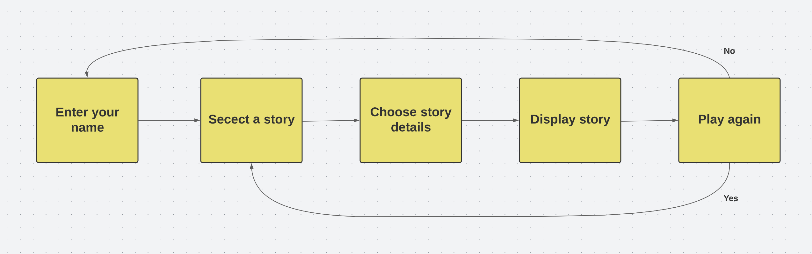
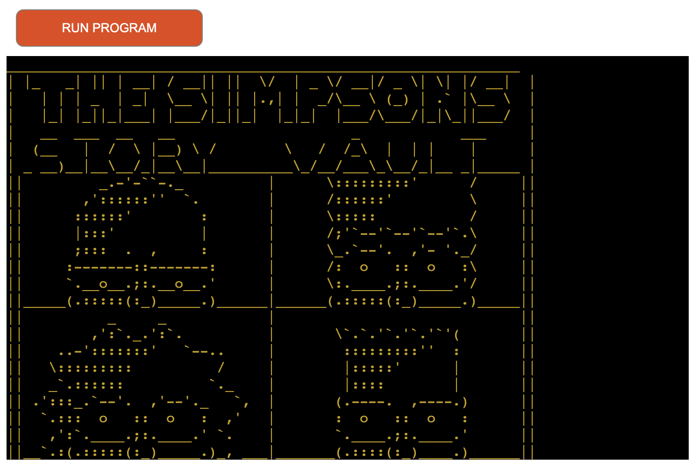
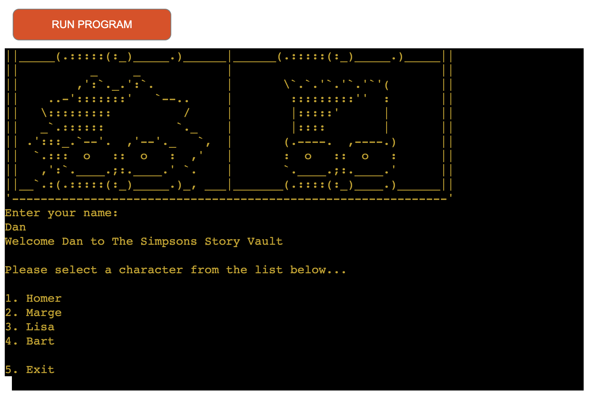
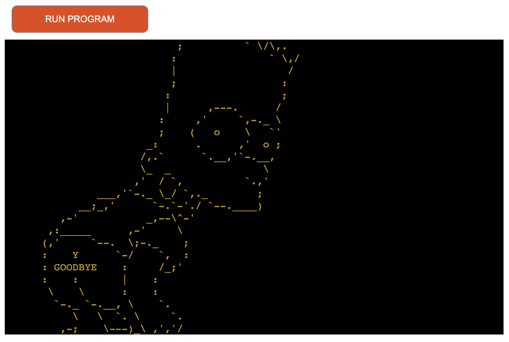
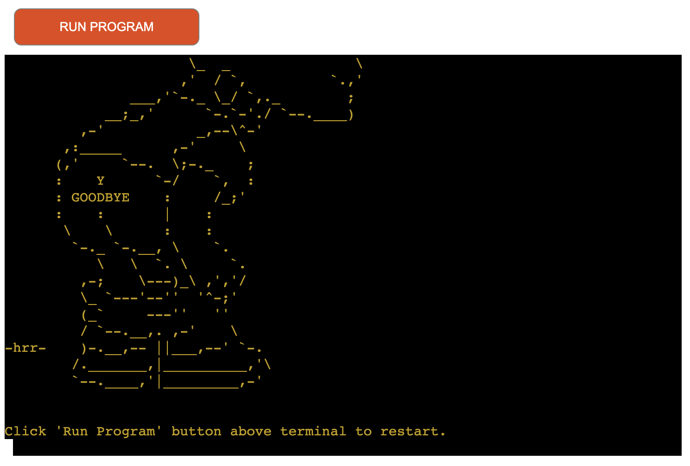
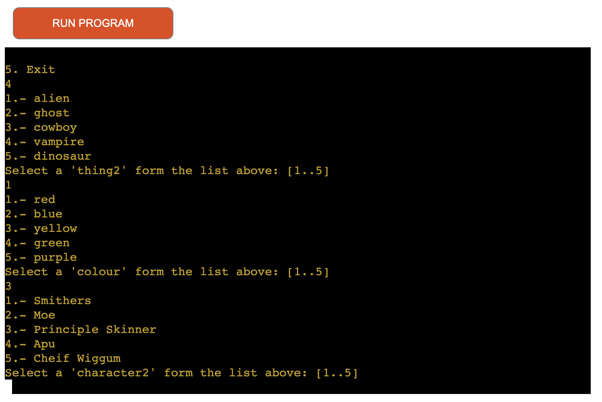
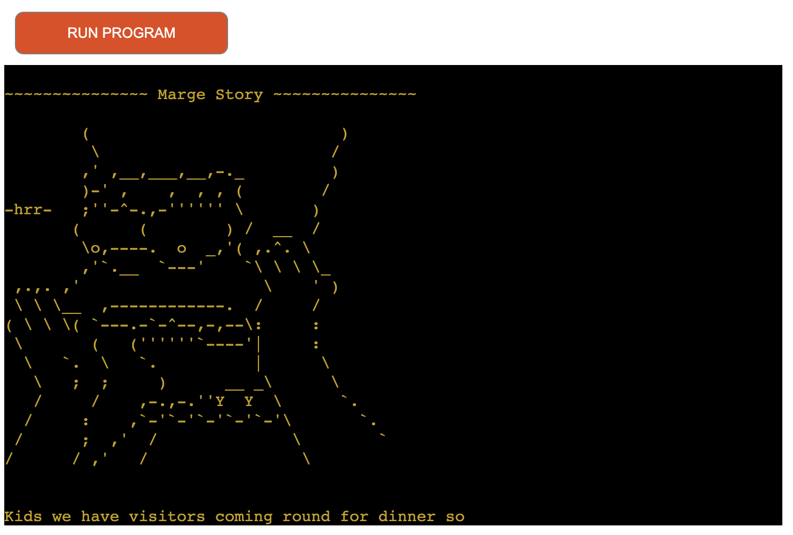
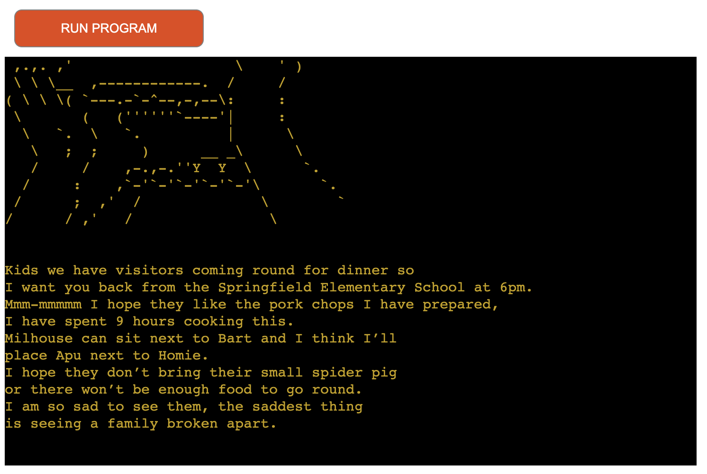
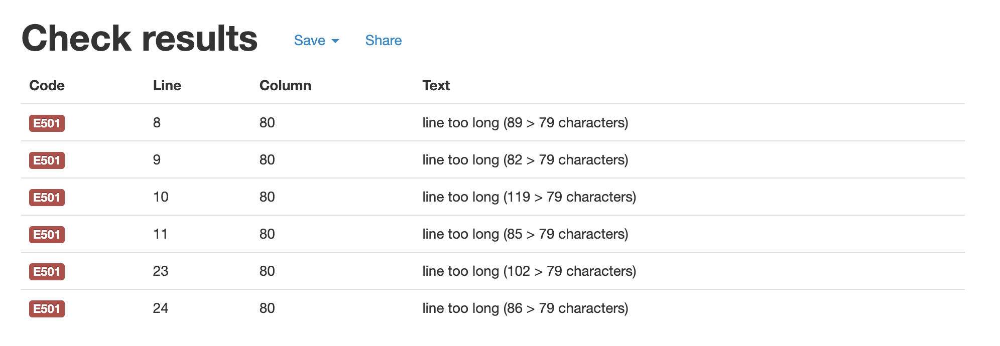
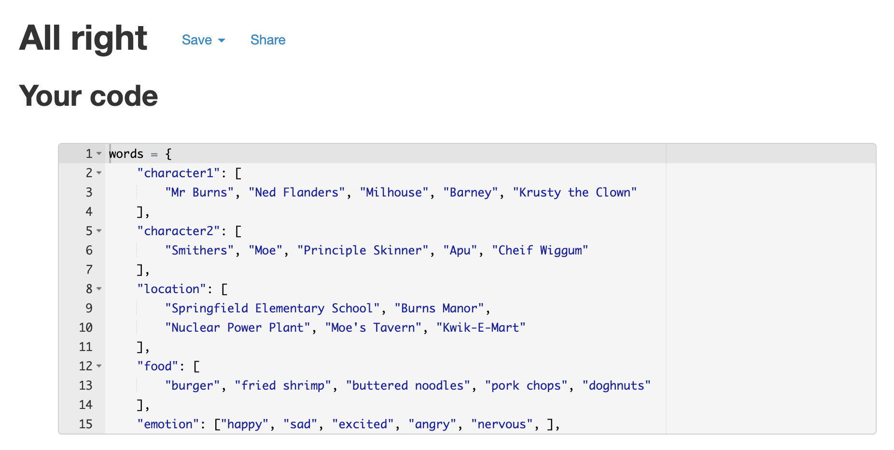

# The Simpsons Story Vault

[View live project here](https://the-simpsons-story-vault.herokuapp.com/)

The Simpson Story Vault is a terminal based story generator with a Simpsons theme. The user selects pre processed words provided in the terminal and a story is created using the words of their choice. The game will continue to play until the user decides to exit.

## Story Vault
Story vaults are used to help children with their English language and literature. The benefit of these are to teach children how to construct stories using an array of grammar. Second benefit for children is it improves their reading skills. The use of a popular cartoon makes learning fun!

## Who are The Simpsons?
The Simpsons is an American animated sitcom that was first aired in 1989. The show is still airing today after 728 episodes and counting. The main characters are the Simpson family who live in a fictional town called Springfield. Although the family is dysfunctional, many episodes examine their relationship and bonds with each other and they often shown to care about one another. The show includes quirky supporting characters. All characters have unique characteristics and sayings which make them very compelling. 

# UX
I decided to create a story generator game for children with a theme to help children learn whilst having fun.

## Target Audience 
* Children age 10+
* Adults who are a fan of The Simpsons 

* People who are learning English 

## The game will help users to:
* Manipulate data
* Navigate through the terminal 
* Test their reading and writing skills 
* Provide entertainment

## Owner Stories
1. As the owner, I want the application to be fun and light hearted for to user.
2. As the owner, I want the game to encourage reading and writing skills.
3. As the owner, I want to display my newly learned skills with Python.

## User Stories
1. As a new visitor, I want to navigate the terminal with ease.
2. As a visitor, I want to exit the program after finishing playing. 
3. As a visitor, I want a choice of words from multiple categories, relating to the story and Simpsons theme.
4. As a visitor, I want to create and read stories based on The Simpsons. 

## The Skeleton
The program had only one page in the terminal. The terminal game is not responsive to users. As it is only one page I used a flow chart instead of wireframes. 

## The Scope
To achieve my goal, I included the following features:

### Features:
1. A welcome message with input name field. 
2. Four stories based on the main characters in The Simpsons.
3. A list of words (foods, animals, adjectives etc) for the user to select which are then returned into the stories.
4. The user can exit the game.

## Design
To align with the user stories, I wanted to ensure the design reflected the Simpsons theme. Therefore, images of the characters were used above the stories. Colorama was installed to change the colour of the text to yellow which ensures the program is on brand as the Simpsons are known for their yellow skin. 

For a better user experience, I imported time. This allows me to add a time break to control how quick the content appears in the terminal. The time.sleep(10) after the story means that once the story has loaded 10 seconds will pass before the next section appears, giving the user time to read the story.

### Things to implement: 
* Three stories per character.
* More words in the dictionary for the user to choose from.

## Technologies Used 
* [Gitpod](https://gitpod.io/workspaces) was used to write the code for the program. 
* [Github](https://github.com/dansantinojones) was used to host the repository and README.
* [Heroku](https://id.heroku.com/login) was used to host and deploy the project.
* [PEP8](http://pep8online.com/) was used to validate my code and search for errors. 
* [Lucid Chart](https://www.lucidchart.com/pages/) was used to plan the project flow. 
* [Am I Responsive](https://ui.dev/amiresponsive) was used to display the program across different screen sizes. 

## Testing
1. As a new visitor, I want to navigate the terminal with ease.
* After the user enters their name they are then asked to select a character using number which will determine the story.

2. As a visitor, I want to exit the program after finishing playing. 
* The user has the option to select number 5 to exit the program.

3. As a visitor, I want a choice of words from multiple categories, relating to the story and Simpsons theme. 
* The user will get the choice of multiple words from numerous categories. Some categories are Simpsons themed (Characters, Food, Location etc). The words chosen will then be used to create a story.

4. As a visitor, I want to create and read stories based on The Simpsons.
* After selection of words, a story based on one of the main Simpsons characters is generated which include the users words they have chosen. A picture of the character is displayed for visual effect. 

### Additional Testing 
* Throughout the project I used the PEP8 validator to confirm my code is bug free.
* I continuously tested the code in the terminal in Gitpod.
* I tested the program using the Heroku terminal to ensure the final outcome worked correctly.

## Compatibility
The program was tested across multiple browsers to ensure the program runs correctly for users to use. The program was tested on desktop and mobile. 
* Chrome 
* Safari (The app is visable but is not responsive)

## Validation
After running my code through the PEP8 Validator, it returned 6 errors. The errors indicated that some lines in the dictionary were too long. 

Once the lists in the dictionary were shortened, I then run the code through the validator again. This time the code passed without any errors.  

## Deployment
This project was deployed using Heroku, committed to git and pushed to GitHub using git commands.

To deploy this page to Heroku from GitHub repository, the following steps were taken:

1. In the Heroku dashboard I selected 'New' in the top right hand corner and clicked on 'Create new app'.
2. Then I Created the App name and Choose my region as Europe. Then selected 'Create app'
3. Then I selected Settings tab, and scrolled down to 'Buildpacks'. Here I added 'Python' clicked saved changes and then selected 'Node.js' and saved my changes again.
4. On top of the page I clicked on the 'Deploy' section, and I selected Github as my deployment method.
5. Then I selected 'Connect to Github, and searched for my repository name and clicked on 'Connect' to link my Heroku app to my Github repository code.
6. Scrolling down I have selected 'Enable Automatic Deploys' and after this I selected 'Deploy Branch' to deploy my project. I had to wait for it to build.
7. After it has successfully deployed a 'view' button appeared which took me to my deployed app.

## Media Credits
* [Mad Libs Game](https://www.glowwordbooks.com/blog/category/kids-online-mad-libs/) for inspiration on the stories. 
* [ASCII Art Archive](https://www.asciiart.eu/cartoons/simpsons) for the images used.
* [Simpsons Wiki](https://simpsons.fandom.com/wiki/Simpsons_Wiki) for the finer details. 

## Acknowledgements
I would like to thank my mentor Guido for his advice and support planning and executing this project. I would like to thank Mia Tothova for the initial idea and undertanding of the code required. 